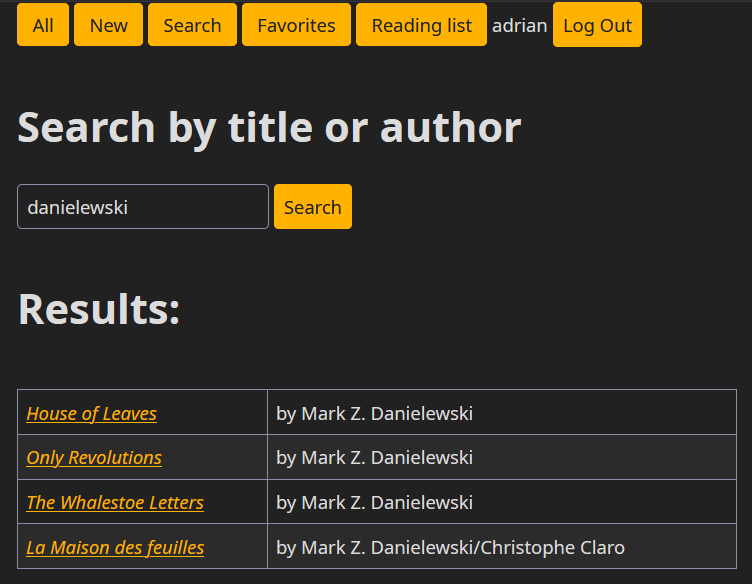
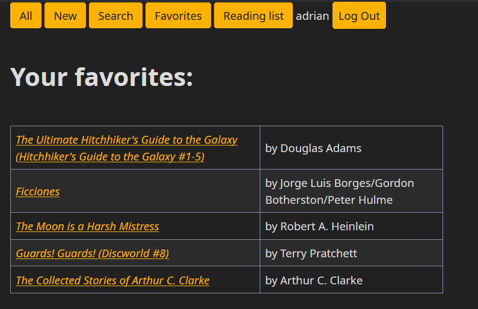
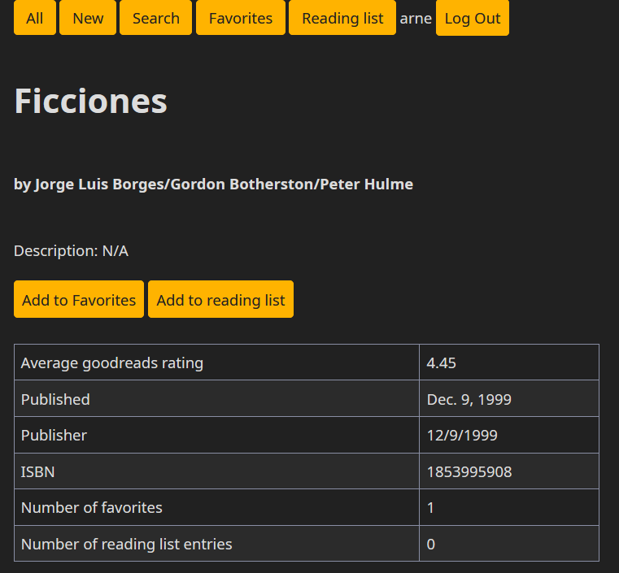
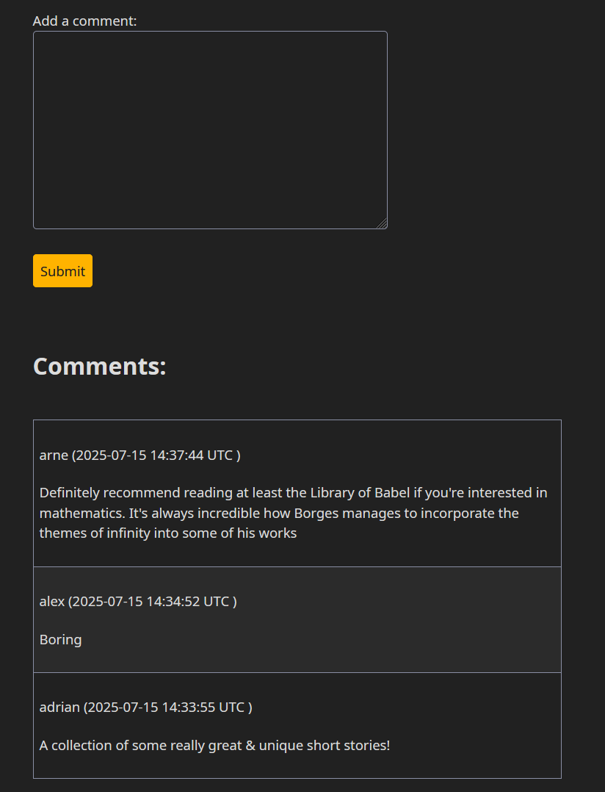

### A Django web app for keeping up with books you want to read and discussing them with others

### Functionality

For all users:
* Search for books by title or author
* View book details (ISBN, published date, # of favorites etc.)
* View comments on each book

For logged-in users:

* Add (publicly visible) comments to books
* Add books to your favorites list (and view it)
* Add books to your reading list (and view it)

For admin (through the django admin panel):
* Add new books
* Hide specific comments
* Modify book/comment information

  
Screenshots

The application uses [Simple.css](https://simplecss.org/) for styling.

For testing the application I've used [this dataset](https://www.kaggle.com/datasets/jealousleopard/goodreadsbooks) from Kaggle. 
To import data simply place `books.csv` at the root of the project (alongside `manage.py` and this readme) and then run `data_import` from the Django shell (it'll use the included script). 